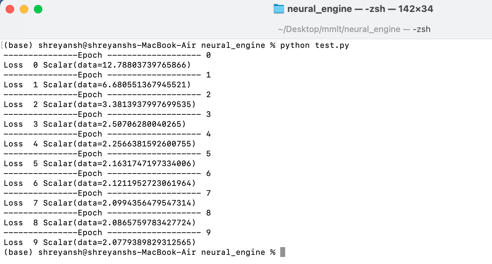
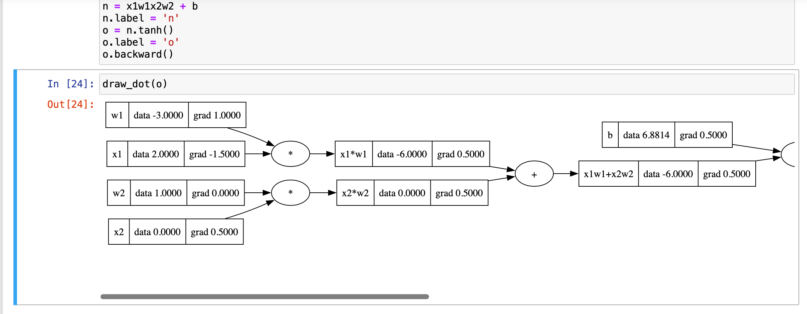

# neural_engine
- neural network  built on a scalar engine rather than regular tensor engine
- inspired by Andrej Karpathy's micrograd tutorials

# test.py

- you can customise your neural network as per your wish
- you can test it on your own dataset by modifying test.py
- 1st argument is no of features of your dataset
- 2nd argument is a list denoting no of neurons in each layer of network
- you can change no of epochs in the file , similarly the learning rate and loss function
- you can plot loss incurred in each training epoch
- it goes through a forward pass
- sets the gradients to zero
- a backward pass to calculate gradients wrt loss function (backpropagation)
- and then updates the weights and biases which are called parameters in our model
- our model implements Stochastic Gradient Descent
- run the file test.py
- you can see below how the loss went from 12.78 to 2.07 after 10 epochs





## scalar.py

This is a simple Python class named `Scalar` which represents scalar values and helps in implementing backpropagation on small neural networks representing arithmetic expressions.

### Features

- Initialization with a scalar value, children nodes, operation type, and label.
- Overloaded arithmetic operations: addition, multiplication, exponentiation, division, subtraction, and negation.
- Elementary mathematical functions: exponential (`exp`) and hyperbolic tangent (`tanh`).
- Automatic differentiation for gradient computation using backpropagation.
- Support for building computational graphs and computing gradients for scalar-valued expressions.

### Comparison between pytorch and Scalar usage

- Implementing $\[
w_1 \cdot x_1 + w_2 \cdot x_2 + b
\] $
where $\( w_1 \)$, $\( w_2 \)$ are weights, $\( x_1 \)$, $\( x_2 \)$ are inputs, and $\( b \)$ is the bias and a backward pass to evaluate gradients in pytorch

```python
import torch

x1 = torch.Tensor([2.0]).double()
x2 = torch.Tensor([0.0]).double()
w1 = torch.Tensor([-3.0]).double()
w2 = torch.Tensor([1.0]).double()
b = torch.Tensor([6.8813735870195432]).double()

x1.requires_grad = True
x2.requires_grad = True
w1.requires_grad = True
w2.requires_grad = True
b.requires_grad = True

n = x1*w1 + x2*w2 + b
o = torch.tanh(n)

print('o: ',o.item())

o.backward()

print('x2',x2.grad.item())
print('x1',x1.grad.item())
print('w1',w1.grad.item())
print('w2',w2.grad.item())
```
Now implementing the same in Scalar :

```python
x1 = Scalar(2.0,label='x1')
x2 = Scalar(0.0,label='x2')

w1 = Scalar(-3.0,label='w1')
w2 = Scalar(1.0,label='w2')

b = Scalar(6.8813735870195432,label='b')

x1w1 = x1*w1
x1w1.label='x1*w1'
x2w2 = x2*w2
x2w2.label = 'x2*w2'

x1w1x2w2 = x1w1 + x2w2
x1w1x2w2.label = 'x1w1+x2w2'

n = x1w1x2w2 + b
n.label = 'n'
o = n.tanh()
o.label = 'o'
o.backward()
```
- We can visualise the gradients and other data as well 


### Usage

You can use the `Scalar` class to perform arithmetic operations, compute mathematical functions, and automatically calculate gradients. Here's a brief overview of how to use it:

```python
# Importing the Scalar class
from scalar import Scalar
import math

# Creating scalar objects
a = Scalar(2)
b = Scalar(3)

# Arithmetic operations
c = a + b
d = a * b
e = a ** 2
f = a / b

# Mathematical functions
g = a.exp()
h = b.tanh()

# Implementing backprop
h.backward()

# Accessing values and gradients
print(c.data, c.grad)
print(d.data, d.grad)
print(e.data, e.grad)
print(f.data, f.grad)
print(g.data, g.grad)
print(h.data, h.grad)
